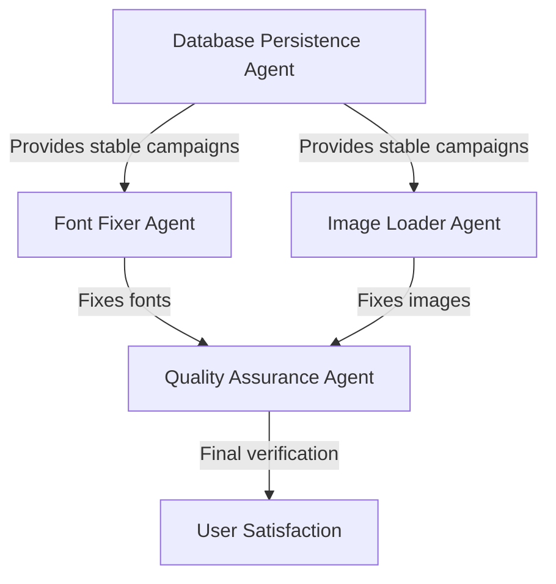

# 🎭 Swarm Orchestration Guide - Master Coordination Document

## 🎯 **MISSION: Coordinate All Agents for Maximum Efficiency**

This guide helps orchestrate the swarm agents to work together effectively, avoid conflicts, and achieve our goal of professional email PNG generation.

## 📊 **CURRENT SWARM STATUS**

### **Active Agents**
1. **Font Fixer Agent** - Fixing "FONTS MISSING" errors
2. **Image Loader Agent** - Fixing campaign image display
3. **Quality Assurance Agent** - Ensuring professional polish
4. **Database Persistence Agent** - Solving database reset issues

### **Agent Dependencies**


## 🔄 **COORDINATION STRATEGY**

### **Parallel Execution Groups**

**Group 1: Foundation** (Can run simultaneously)
- Database Persistence Agent (Critical - affects all others)
- Font Fixer Agent (Independent issue)

**Group 2: Content** (Can run after Group 1)
- Image Loader Agent (Needs stable campaigns from DB agent)

**Group 3: Polish** (Runs last)
- Quality Assurance Agent (Needs all fixes in place)

### **Communication Channels**

Each agent should update their status in a shared status file:

```python
# popup-system/api/swarm_status.json
{
    "database_persistence": {
        "status": "in_progress",
        "progress": "Auto-restore implemented, testing persistence",
        "blockers": [],
        "eta": "30 minutes"
    },
    "font_fixer": {
        "status": "in_progress", 
        "progress": "Bundling fonts with deployment",
        "blockers": [],
        "eta": "45 minutes"
    },
    "image_loader": {
        "status": "waiting",
        "progress": "Waiting for stable campaign database",
        "blockers": ["database_persistence"],
        "eta": "1 hour after unblocked"
    },
    "quality_assurance": {
        "status": "waiting",
        "progress": "Waiting for font and image fixes",
        "blockers": ["font_fixer", "image_loader"],
        "eta": "30 minutes after unblocked"
    }
}
```

## 🚨 **CRITICAL COORDINATION POINTS**

### **1. Database Changes**
- **Database Agent** must notify others when schema changes
- **All Agents** must handle both old and new database structures
- **Backup before any destructive changes**

### **2. Code Conflicts**
Multiple agents may edit `main.py`. Coordination needed:

```python
# main.py sections assigned to each agent:
# Lines 1-150: Core imports and setup (no changes)
# Lines 151-220: Font loading (Font Fixer Agent)
# Lines 221-400: Image handling (Image Loader Agent)
# Lines 401-600: PNG generation (Quality Assurance Agent)
# Lines 601-800: Database operations (Database Persistence Agent)
# Lines 801+: API routes (coordinate changes)
```

### **3. Deployment Timing**
```bash
# Deployment sequence to avoid conflicts:
1. Database Persistence Agent deploys auto-restore
2. Wait for confirmation campaigns are stable
3. Font Fixer Agent deploys bundled fonts
4. Image Loader Agent deploys image fixes
5. Quality Assurance Agent runs final tests
6. Final coordinated deployment with all fixes
```

## 📋 **SHARED RESOURCES**

### **Test Data**
All agents should use these test cases:

```python
TEST_CAMPAIGNS = [
    {
        "name": "Trading Tips",
        "property": "mmm",
        "description": "Get exclusive trading tips delivered daily",
        "cta_text": "Get Trading Tips",
        "expected_image": "finance_chart.jpg"
    },
    {
        "name": "Daily Goodie Box",
        "property": "mff",
        "description": "Free samples delivered to your door", 
        "cta_text": "Claim Now!",
        "expected_image": "gift_box.jpg"
    }
]

TEST_PROPERTIES = ["mff", "mmm"]
TEST_DIMENSIONS = [(600, 400), (300, 200), (1200, 800)]
```

### **Shared Utilities**
Create shared helper functions:

```python
# popup-system/api/utils/swarm_helpers.py

def log_agent_action(agent_name: str, action: str, details: dict = None):
    """Centralized logging for agent coordination"""
    timestamp = datetime.now().isoformat()
    log_entry = {
        "timestamp": timestamp,
        "agent": agent_name,
        "action": action,
        "details": details or {}
    }
    
    # Append to coordination log
    with open("swarm_coordination.log", "a") as f:
        f.write(json.dumps(log_entry) + "\n")

def check_agent_dependencies(agent_name: str) -> bool:
    """Check if agent's dependencies are satisfied"""
    status = json.load(open("swarm_status.json"))
    agent_info = status.get(agent_name, {})
    
    for blocker in agent_info.get("blockers", []):
        if status.get(blocker, {}).get("status") != "completed":
            return False
    
    return True

def notify_agent_complete(agent_name: str, results: dict):
    """Notify other agents of completion"""
    # Update status file
    # Send webhook/notification if configured
    # Log completion
    pass
```

## 🎯 **SUCCESS METRICS**

### **Individual Agent Success**
- **Database**: Auto-restore works, campaigns persist
- **Fonts**: No "FONTS MISSING" watermark
- **Images**: Real campaign images display
- **Quality**: Professional appearance matching design

### **Swarm Success**
- **All agents complete** within 4 hours
- **No conflicts** between agent changes
- **Final product** works perfectly
- **User satisfaction** achieved

## 🔍 **MONITORING & DEBUGGING**

### **Real-time Monitoring**
```bash
# Watch agent progress
tail -f swarm_coordination.log | jq '.'

# Check current status
cat swarm_status.json | jq '.'

# Monitor Railway logs
railway logs -f | grep -E "(AGENT|SWARM|ERROR)"
```

### **Debug Checkpoints**
1. **After each agent deploys**: Test core functionality
2. **Before final deployment**: Run integration tests
3. **After final deployment**: Full system verification

## 🚦 **CONFLICT RESOLUTION**

### **Code Merge Conflicts**
If agents edit same code sections:
1. **Agent with simpler change** goes first
2. **Second agent** rebases on first agent's changes
3. **QA agent** reviews final merged code

### **Database Conflicts**
If schema changes conflict:
1. **Stop all agents**
2. **Database agent** creates unified schema
3. **Resume other agents** with new schema

### **Deployment Conflicts**
If deployments interfere:
1. **Use deployment queue**
2. **Each agent gets 30-minute window**
3. **Rollback plan** ready for each deployment

## 📝 **FINAL CHECKLIST**

Before declaring swarm success:

- [ ] Database Persistence Agent: Auto-restore working
- [ ] Font Fixer Agent: Fonts rendering properly  
- [ ] Image Loader Agent: Images displaying correctly
- [ ] Quality Assurance Agent: Professional polish applied
- [ ] Integration: All components work together
- [ ] Performance: Fast response times
- [ ] Stability: Survives deployment cycles
- [ ] Documentation: All changes documented

## 🎉 **COMPLETION CRITERIA**

The swarm succeeds when:
1. **Email PNGs generate** with proper fonts and images
2. **Quality matches** the original popup design
3. **System survives** Railway deployments
4. **User confirms** satisfaction with results

## 🔄 **HANDOFF TO USER**

When all agents complete:
1. **Generate final test report** with screenshots
2. **Provide deployment instructions**
3. **Document any remaining minor issues**
4. **Celebrate success!** 🎊

**Remember: We're stronger together - coordinate, communicate, succeed!**
